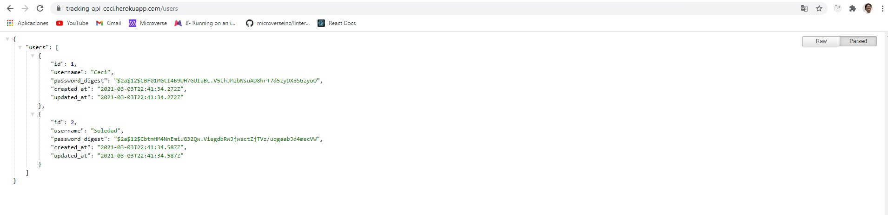
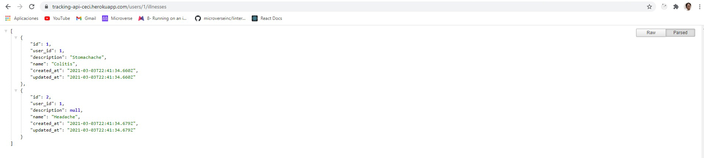

# Final Capstone Project Project API : Tracking app

## Table of Contents

* [About the Project](#about-the-project)
* [The Back-End API](#the-back-end-api)
* [How To Use it](#how-to-use-it)
* [Tecnologies used](#tecnologies-used)
* [Author](#author)
* [Show your Support](#show-your-support)
* [Acknowledgements](#acknowledgements)

<!-- ABOUT THE PROJECT -->
## About The Project

The objective of this project was to create a tracking App in which a user is presented with a list of things to be measured. I used Ruby on Rails for the Back-End API.





Live version of the project: 

[Live version](https://tracking-api-ceci.herokuapp.com/)

<!-- THE BACKEND API -->
## The Back End API

The back-end for this project consists of a REST API that manages the "finalproject-api" database. This database is integrated by the next tables:

1. User Table: For storing username, and encrypted password and password confirmation

2. Illness Table: For storing the name of the illness, and its description. It is depended on the user.

3. Tracking Table:  Include the daily information of the illness. This information includes:
* Temperature
* Mood
* Date
* Medicines
* Symptoms


<!-- HOW TO USE IT -->
### How to use it locally using these steps:

#### Clone my repository

``` git clone https://github.com/Ceci007/final-capstone-api.git ```

#### Go to my project's folder

``` cd project-name ```

#### Get the dependencies needed

``` bundle install ```

#### Create and migrate the tables
``` rails db:create ```
``` rails db:migrate ```
``` rails db:seed ```

#### Start the server
``` rails server ```

<!-- TECNOLOGIES USED -->
## Tecnologies used

* Ruby on Rails
* Heroku
* Postgresql
* Rspec
* bcrypt

<!--AUTHOR -->
## Author
👤 ***Cecilia Benitez***

- Github: [@Ceci007](https://github.com/Ceci007)
- Twitter: [@CeciDeveloper](https://twitter.com/CeciDeveloper)
- Linkedin: [LinkedIn](https://www.linkedin.com/in/cecilia-benítez)
- Portfolio: [cecibenitez.com](https://www.cecibenitez.com/)

<!-- SHOW YOUR SUPPORT -->
## Show your Support

Give a star if you like this project!

<!-- ACKNOWLEDGEMENTS -->
## Acknowledgements

* [Microverse](https://www.microverse.org/)
